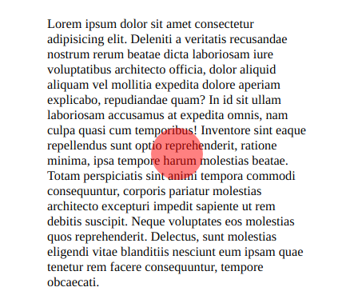
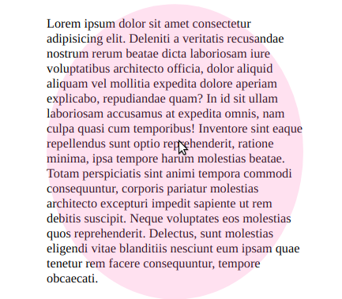

# Instructions

1. Make the `div` appear as a `red` circle in the centre of the paragraph, with an opacity of `0.5`.

2. Create a rule for the selector `div:hover` so that, when the mouse is over the `div`
   * The circle expands to an `ellipse` that fills the height and width of the paragraphy
   * The `color` of the `div` changes from `red` to `hotpink`
   * The  `opacity` of the `div` changes from `0.5` to `0.2`

3. Ensure that the transition of shape, color and opacity takes 1 second when expanding and 0.5s when contracting.
